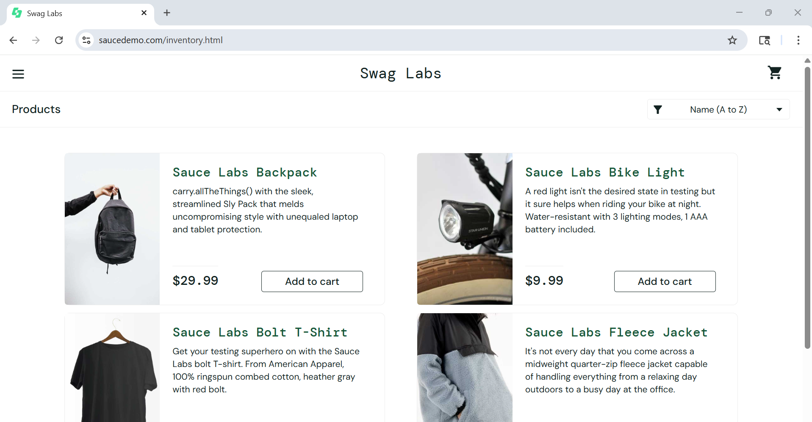
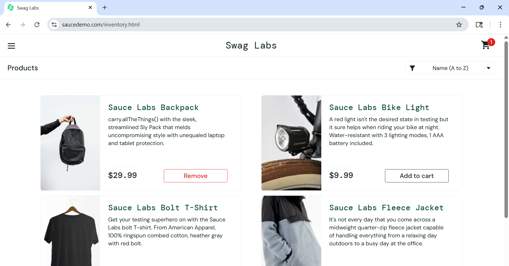
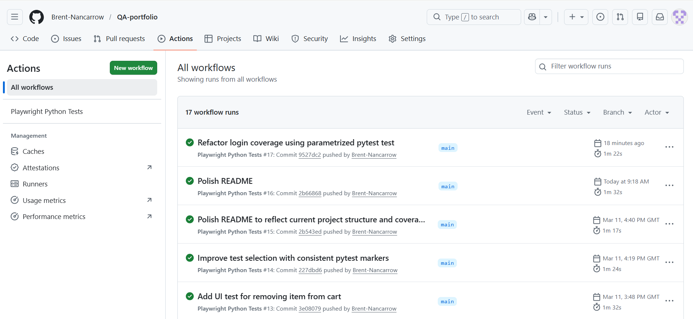

# QA-portfolio

A beginner-friendly but commercially credible QA portfolio project built in **PyCharm** with **Python, Playwright and pytest**.

It is designed to show practical, modern QA capability in a realistic and maintainable way, including:

- **UI testing** against Sauce Demo
- **API testing** against JSONPlaceholder
- **SQL-backed data validation** using SQLite
- **dashboard/report validation** using exported report data and a simple dashboard mock
- **Page Object Model (POM)** structure for cleaner UI test design
- **shared config, reusable test data and helper utilities**
- **responsive/mobile viewport coverage**
- **failure evidence** such as trace, video and screenshots on failure
- **Allure reporting** for clearer stakeholder review of execution evidence
- **GitHub Actions CI** for automated test execution
- **selective test execution** using pytest markers
- **AI-assisted QA workflow documentation** showing how GenAI can support testing in a controlled, human-reviewed way

The aim is not to present as a senior automation engineer, but to show practical hands-on capability as a **Senior Manual QA / Workstream Test Lead / assurance-led QA professional** adding modern tooling in a commercially realistic way.

---

## At a glance

- **Primary focus:** practical QA automation with commercially realistic scope
- **UI target:** Sauce Demo
- **API target:** JSONPlaceholder
- **Data target:** local SQLite dataset for reporting-style validation
- **Test types shown:** UI, API, smoke, responsive/mobile, negative and data/report validation
- **Evidence shown:** Playwright trace/video/screenshots plus Allure reporting
- **Execution modes:** headed locally, headless in CI
- **Portfolio goal:** demonstrate maintainable test design, evidence capture, and stakeholder-friendly QA thinking

---

## What this project demonstrates

This project currently demonstrates:

- UI smoke and functional checks using Playwright
- API checks using Playwright API request support with pytest
- separation of UI, API and data/report validation coverage
- maintainable UI structure using page objects
- reusable helpers, shared settings and test data
- local headed execution and CI headless execution
- responsive testing using a mobile-style viewport
- GitHub Actions CI pipeline
- failure investigation support using trace, video and screenshots on failure
- Allure-ready execution evidence for clearer review of test outcomes
- SQL-backed data quality and dashboard/report validation using SQLite
- AI-assisted QA workflow support that keeps testing judgement, review and release confidence human-led

---

## Why this portfolio is useful

Many public QA portfolios stop at simple browser checks. This project is intended to go further by showing a balanced mix of:

- practical UI and API coverage
- maintainable project structure
- data and reporting assurance
- failure investigation support
- evidence that can be reviewed by stakeholders
- commercially relevant tooling without over-engineering
- a realistic AI-assisted QA workflow rather than treating AI output as trusted by default

It is deliberately aimed at the kind of work I do and want to keep doing: **hands-on QA, test assurance, release confidence, and quality visibility**.

---

## AI-assisted development approach

This portfolio was developed using an **AI-assisted workflow** to help accelerate learning, structure ideas, and speed up parts of the implementation.

AI support was used as an assistive tool rather than a substitute for QA judgement. The test scope, scenario selection, review, refinement, validation, and final portfolio decisions remained human-led.

This was included deliberately because modern QA work is increasingly influenced by AI-assisted tooling. I wanted the portfolio to reflect a practical and commercially realistic approach: using AI to support the workflow while keeping evidence review, testing judgement, and release confidence human-owned.

See also: `docs/ai-assisted-qa-workflow/`

---

## Tech stack

- **Python**
- **PyCharm**
- **pytest**
- **Playwright**
- **SQLite**
- **Allure**
- **Git / GitHub**
- **GitHub Actions**

---

## Public test targets

### UI
- Sauce Demo

### API
- JSONPlaceholder

These public targets were chosen because they are safe, accessible and suitable for portfolio demonstration work.

---

## Project structure

```text
QA-portfolio/
├── .github/
│   └── workflows/
│       └── playwright.yml
├── assets/
│   ├── reporting/
│   │   └── orders_dashboard.html
│   └── screenshots/
├── config/
│   └── settings.py
├── data/
│   ├── reporting/
│   │   ├── dashboard_expected.json
│   │   ├── dashboard_export.json
│   │   ├── orders_schema.sql
│   │   └── orders_seed.sql
│   └── users.py
├── docs/
│   └── ai-assisted-qa-workflow/
│       ├── README.md
│       ├── ai-output-review-checklist.md
│       ├── ai-test-design-prompt-pack.md
│       ├── example-defect-investigation-workflow.md
│       └── example-story-analysis.md
├── pages/
│   ├── inventory_page.py
│   └── login_page.py
├── tests/
│   ├── api/
│   │   ├── test_api_create_post.py
│   │   ├── test_api_get_posts.py
│   │   └── test_api_users.py
│   ├── data/
│   │   ├── test_dashboard_export_validation.py
│   │   └── test_orders_dashboard_sql.py
│   └── ui/
│       ├── test_reporting_dashboard_mock.py
│       ├── test_saucedemo_inventory.py
│       ├── test_saucedemo_login.py
│       ├── test_saucedemo_responsive.py
│       └── test_saucedemo_smoke.py
├── utils/
│   ├── allure_helpers.py
│   ├── api_helpers.py
│   ├── report_helpers.py
│   └── sql_helpers.py
├── conftest.py
├── pytest.ini
├── README.md
└── requirements.txt
```

### Structure notes

- **pages/** contains the page objects for UI tests
- **data/** contains reusable test data plus SQL/reporting seed and export files
- **assets/reporting/** contains a simple stakeholder-facing dashboard mock
- **docs/ai-assisted-qa-workflow/** contains the AI workflow pack showing how GenAI can support QA work in a controlled and review-led way
- **config/** contains shared settings such as base URLs
- **tests/ui/** contains Playwright-based UI tests
- **tests/api/** contains API tests
- **tests/data/** contains SQL/data/report validation tests
- **utils/** contains small reusable helper logic

---

## Why page objects were used

Page objects were introduced to keep the UI tests cleaner and easier to maintain.

In simple terms:

- the **test files** describe the behaviour being checked
- the **page files** hold the page locators and reusable page actions

This avoids repeating the same locator details across multiple tests and makes the project easier to scale.

---

## Test coverage included so far

### UI coverage

- login page smoke checks
- successful login flow
- locked out user validation
- inventory page validation
- add-to-cart cart badge validation
- remove-from-cart cart badge validation
- responsive/mobile viewport login page check
- dashboard mock value display check

### API coverage

- GET `/posts` checks
- GET `/users` checks
- POST `/posts` checks
- response status validation
- response body/content validation
- basic response structure/key validation
- negative API coverage for a non-existent post returning `404`

### Data / dashboard coverage

- SQL-backed total order validation against a local SQLite dataset
- status breakdown validation
- completed-order revenue validation
- valid status checks
- duplicate ID detection
- negative amount detection
- exported dashboard/report validation against SQL-derived results
- dashboard metadata validation

### AI-assisted QA workflow coverage

- example prompt patterns for AI-assisted test design
- checklist for reviewing AI-generated output before trusting it
- worked example of story-level analysis using AI as a starting point
- worked example of defect investigation support with human-led evidence review
- explicit demonstration that AI output is draft material, not trusted QA evidence

---

## Screenshots

### Inventory page after successful login



### Cart badge updates after adding an item



### GitHub Actions CI run



---

## Setup

### 1. Clone the repository

```bash
git clone https://github.com/Brent-Nancarrow/QA-portfolio
cd QA-portfolio
```

### 2. Create and activate a virtual environment

#### Windows PowerShell

```powershell
python -m venv .venv
.venv\Scripts\Activate.ps1
```

#### Windows Command Prompt

```cmd
python -m venv .venv
.venv\Scripts\activate
```

### 3. Install dependencies

```bash
pip install -r requirements.txt
```

### 4. Install Playwright browsers

```bash
playwright install
```

If needed:

```bash
python -m playwright install
```

---

## Running the tests

### Run all tests

```bash
pytest
```

### Run only UI tests

```bash
pytest -m ui -v
```

### Run only API tests

```bash
pytest -m api -v
```

### Run only smoke tests

```bash
pytest -m smoke -v
```

### Run only responsive tests

```bash
pytest -m responsive -v
```

### Run only SQL/data validation tests

```bash
pytest -m data -v
```

### Run dashboard export validation directly

```bash
pytest tests/data/test_dashboard_export_validation.py -v
```

### Run the dashboard mock UI check directly

```bash
pytest tests/ui/test_reporting_dashboard_mock.py -v
```

---

## Local vs CI execution

This project is configured so that:

- **local runs** open the browser in headed mode for easier visibility
- **CI runs** execute headless in GitHub Actions

This is controlled in `conftest.py` using the `CI` environment variable.

---

## Failure evidence

The project is configured to retain useful evidence on failure, including:

- **Playwright trace**
- **video**
- **screenshots**

This helps support investigation and debugging when a test fails.

---

## Continuous Integration

GitHub Actions is configured to run the test suite automatically on:

- push to `main`
- pull requests
- manual workflow dispatch

The workflow also retains:

- **Playwright test results** for failure investigation support
- **Allure raw results** for report generation and execution review

This helps show that the project can run both locally and in an automated pipeline while keeping reviewable evidence.

---

## SQL / data / dashboard validation slice

This portfolio includes a lightweight **SQL-backed reporting validation slice** using **SQLite** and **pytest**.

It demonstrates:

- validating source data using SQL queries
- checking dashboard/report-style totals and status breakdowns
- validating completed-order revenue
- basic data quality checks such as valid statuses, duplicate ID detection and negative amount detection
- validating an exported dashboard/report JSON against SQL-derived results
- checking a simple dashboard mock displays the expected figures
- attaching SQL queries and result evidence into **Allure**

This was added deliberately to reflect commercially realistic QA work beyond UI/API checks, especially where confidence in **reports, dashboards and business-critical outputs** matters.

---

## Allure reporting

This project includes **Allure-ready test reporting** to make execution results easier for stakeholders to review.

### What Allure adds

- clearer pass/fail execution status
- named test titles and test steps
- JSON request/response evidence for API checks
- SQL query/result evidence for data checks
- screenshot and page URL attachments for failed UI tests

### Install the Allure pytest plugin

```bash
pip install allure-pytest
```

### Run tests and save Allure results

```bash
pytest --alluredir=allure-results
```

### Open a temporary Allure report

```bash
allure serve allure-results
```

### Generate a saved report folder

```bash
allure generate allure-results --clean -o allure-report
allure open allure-report
```

> Note: the Allure command-line tool also needs to be installed separately on your machine.

### Why this matters in the portfolio

Allure improves the visibility of:

- what ran
- what passed or failed
- which steps were executed
- what API or SQL evidence was captured
- what UI evidence was attached on failure

That makes the project more useful for interview discussion because it shows not just test execution, but also **evidence, traceability and reviewability**.

---

## AI-assisted QA workflow pack

This portfolio includes a small **AI-assisted QA workflow pack** under `docs/ai-assisted-qa-workflow/`.

It is designed to show a practical, controlled and commercially realistic approach to using Generative AI in QA work.

### What it includes

- example prompts for test idea generation and exploratory support
- a checklist for reviewing AI-generated output
- story-analysis examples showing AI as a starting point, not an authority
- defect-investigation examples showing where AI can assist communication without replacing evidence-led QA judgement

### Why it matters

The aim is not to claim that AI should replace testers. The aim is to show how AI can support:

- faster test idea generation
- exploratory structure
- requirement gap analysis
- defect communication drafting
- workflow efficiency

while keeping:

- QA judgement
- risk prioritisation
- evidence review
- validation
- release confidence decisions human-led.

---

## Stakeholder-facing assurance artefacts

This portfolio also includes a small **stakeholder assurance pack** to show how hands-on QA execution can be translated into release-readiness style outputs.

The aim is to demonstrate not only test execution, but also quality communication, scope/risk visibility and evidence-led go/no-go style thinking.

See: `docs/stakeholder-assurance-pack/`

---

## Why this project matters for my portfolio

This repository is intended to show practical, honest capability in modern QA tooling without pretending to be an advanced automation specialist.

It supports my positioning as a **Senior Manual QA / Workstream Test Lead / assurance-led QA professional** who is adding:

- Python
- Playwright
- pytest
- API coverage
- SQL/data/report validation
- CI awareness
- maintainable test structure
- stakeholder-friendly evidence presentation
- AI-assisted workflow support with human review and control

in a realistic and commercially grounded way.

---

## How to talk about this project in interviews

A simple and honest way to describe this portfolio is:

> I built this project to demonstrate practical QA capability using Python, Playwright and pytest in a way that reflects my real background. It shows UI, API and SQL-backed data/report validation coverage, maintainable structure, CI execution, failure evidence, Allure reporting, and an AI-assisted QA workflow pack that demonstrates how I would use Generative AI as a support tool rather than a substitute for testing judgement.

It also supports conversations around:

- modern tooling adoption as a hands-on QA lead / senior manual QA
- stakeholder-friendly reporting and evidence
- maintainability over automation for automation’s sake
- quality visibility and release confidence
- practical AI-assisted QA workflows with human-led review
